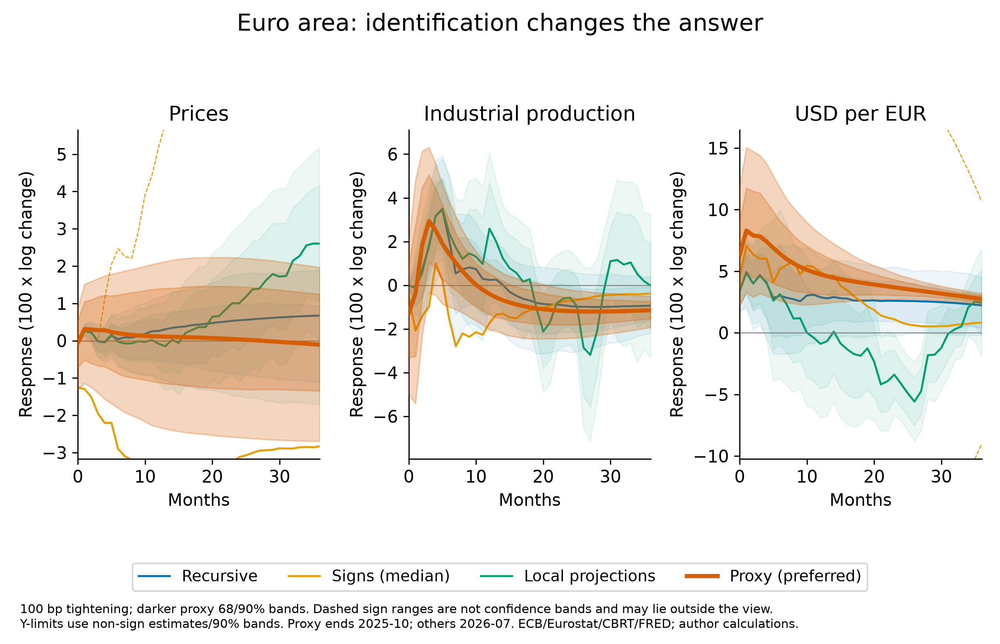

# macro-var-lab

How much does the euro area's response to a rate increase depend on how the policy shock is identified?

We compare four ways of isolating a 100-basis-point tightening in monthly euro-area data. We trace prices, industrial production and the exchange rate over 36 months, with uncertainty shown. We prefer the event-window proxy when its strength gate passes and retain the original Türkiye comparisons.

[Read the two-page policy note (PDF)](report/policy_note.pdf) · [Full technical report](report/report.md)

## Findings

- The exchange-rate channel is clear: a year after tightening, the euro is 4.744% stronger in the preferred proxy estimate, and its uncertainty interval stays above zero.
- The price response is not pinned down: estimates change sign across identification methods, while the proxy estimate of 0.113% has an uncertainty interval that includes zero.
- Türkiye's price estimates are negative across the comparison methods but imprecise; the recursive estimate a year after tightening is -0.288%.

## Reproduce

Install Python 3.11, uv and Git. Copy `.env.example` to `.env` and supply your own `FRED_API_KEY` and `EVDS_API_KEY`; values must stay private. `make setup all` acquires official data and builds results. `make quick` is isolated synthetic/offline; `make test lint`. See [reproduction notes](docs/REPRODUCTION.md). No raw redistribution.

## Technical notes

The EA headline compares recursive, signs, direct cumulative-outcome HAC local projections and proxy identification. The proxy relevance gate holds (F=19.544578, 251 residual observations); this supports conditional preference under the review decision, not proof of exclusion. Combined Monetary Event Window, OIS_2Y; overlapping sample September 2004-October 2025, lag3 refit versus baseline lag7 through July 2026. Differences mix identification, sample and lag: not a controlled identification-only contrast. Later instrument months are missing, not zero. Proxy price and IP bands include zero; euro appreciation does not. The weak positive price response is a price puzzle, reported without tuning.

All proxy price/IP/FX horizons0-36 and 68/90 bands are in results/ea_proxy_irfs.csv. Paired residual-IV block bands condition on estimated VAR slopes; 397 of 499 resamples pass the instrument-strength gate, with weak draws omitted. These are pointwise conditional intervals, not full-slope or weak-IV-robust confidence sets. Sign medians/ranges reflect restrictions imposing early disinflation; they are not sampling bands. For readability, the headline y-limits follow recursive/LP/proxy point estimates and90% bands; thin dashed admissible sign endpoints and sign medians may be outside this view. Full untrimmed endpoints remain in the aggregate tables. Display changes no estimate or accepted rotation. Percent responses here denote100 x log changes, as in the source IRFs. Recursive Kilian 200-bias/499 outer draws; ordinary block-bootstrap robustness, conditional on lag/transform selection. Equation BG order1 lag search is an intersection of marginal tests, not a system LR test; flagged BIC fallback where none passes. Initially unstable models are not forced into stationarity.

TR is unchanged: AOFM2011-01 to2026-07, approved price inflation transformation after levels diagnostics, lag9, remaining instability acknowledged. results/tr_identification_irfs.csv and figures/tr_identification show recursive, FX-first and LP side by side. Exchange-rate orientation: EA USD per EUR (increase=appreciation), TR TRY per USD (increase=depreciation). Ordering changes the TR response magnitude; at month12 all three point estimates are negative but imprecise. LP does not repair identification. Recent regime uses four-variable short-horizon LP only. Mixed integration blocks VECM; exact10% depreciation pass-through LP is labelled fallback. Annual historical aggregates/FEVD and original robustness tables retained; no new TR estimation.

Reproduction status is in results/reproduction_check.json; ECB public GET transient/network failures retry at most5 times with1,2,4,8-second exponential waits. Permanent errors stop immediately; final errors include the public endpoint and status without credentials. No raw redistribution. Theory references: Sims, Stock & Watson(1990),10.2307/2938337; Kilian(1998),10.1162/003465398557465; Jorda(2005),10.1257/0002828053828518; Altavilla et al.(2019),10.1016/j.jmoneco.2019.08.016.

## Licence

Code is MIT-licensed; third-party source data retain their original terms and are not included. Publication files and safety checks are documented in [docs/PUBLISH_CHECKLIST.md](docs/PUBLISH_CHECKLIST.md).

Hakan Zeki Gulmez | [GitHub](https://github.com/hakangulmez) | [LinkedIn](https://www.linkedin.com/in/hakan-zeki-g%C3%BClmez-088700180/)
