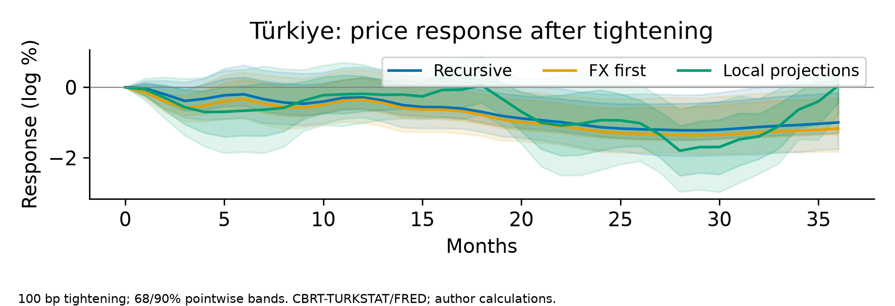

# Euro area: a controlled methods comparison

How do monetary-response estimates differ on the same usable sample and fixed lag specification?

We compare recursive VAR, sign-restricted VAR, recursive-shock local projections and proxy VAR on the same usable monthly sample. We report both fixed lag panels and trace a 100-basis-point tightening over thirty-six months. We retain the original Türkiye comparisons and interpret proxy evidence conditionally on instrument validity.

- On the common sample, proxy euro appreciation at month twelve is 4.551 log percent at p=3 (1.889, 7.630) and 3.305 at p=7 (0.648, 5.505); both conditional 90% bands exclude zero.
- The price response remains imprecise: proxy month-twelve estimates are 0.172 at p=3 and -0.078 at p=7, with both bands including zero. Sign restrictions impose early disinflation; their ranges are not confidence intervals.
- Türkiye results are inherited: recursive month-twelve price response is -0.288 log percent. Recursive, FX-first and recursive-shock LP price point estimates remain negative but imprecise.

## Limitations

- Proxy exogeneity remains an assumption; bands condition on fitted dynamics.
- Sign-admissible ranges are not confidence intervals.
- Both common-sample VARs remain slightly unstable.
- LP uses fewer supported origins at longer horizons.
- Latest-vintage observations do not recreate real-time information.

## Technical notes

V3 methods comparison on a common sample and lag specification: April2005–October2025,247 usable VAR observations for both p3 and p7; September2004–March2005 supplies lag history only. The user authorized this mechanical start adjustment before comparison results because the frozen yield starts September2004. All original frozen inputs remain unchanged. Six variables, existing transforms, intercept/month indicators,100bp shock and36-month horizons fixed within each panel. Response estimators differ: recursive-shock LP uses the recursive innovation and VAR-design/ordered-predecessor controls, with horizon-specific supported origins247−h (235 at h12). It is not an identification-only contrast.

Proxy instrument remains combined EA-MPD Monetary Event Window/OIS_2Y. First-stage F p3=19.597947,p7=18.826251; both exceed the unchanged10 threshold. Exogeneity is not established. Conditional paired block6 inference fixes VAR propagation slopes and omits weak draws: p3 accepted407/499,p7 accepted379/499. This is not weak-IV-robust/full-chain inference. Recursive iid Kilian bias200/outer499, original sign restrictions1000 admissible rotations, existing LP HAC remain. Sign medians/ranges may lie beyond figure limits; full ranges are in CSV. Neither lag was selected by narrative or significance. Spectral radii p3=1.000726,p7=1.003395 exceed one; unstable dynamics remain visible.

Inherited TR IRFs, regimes, transformations and original alternatives are unchanged. The policy-column bug is fixed by labels.index('policy'), with invariant reorder tests and only affected Granger entries regenerated. Historical accounting remains inherited recursive Cholesky, not proxy accounting. FEVD fractions describe native outcomes (EA price levels; TR monthly inflation), unnormalized unit-variance shocks; exported tables name sample,lag and units. HD reports arithmetic annual averages of monthly100ΔlogP in percentage points, NOT annual/cumulative inflation. Native TR inflation uses the same scale. Coverage and number of months appear for every year;2026 contains January–July,seven months,without annualisation. Components reconcile with represented levels/monthly inflation, with checks in v3_hd_accounting.json. This descriptive decomposition is not a structural explanation of each episode or a policy counterfactual.

New V3 methods outputs are distinct from inherited g3_irfs/ea_proxy_irfs and original full-window accounting. Dated V2 copies and original private-artifact hashes remain in versions/v2-2026-10-07/HASHES.json. Protocol, source workbook, processed data and private bootstrap lineage are recorded in V3 manifests. No raw data, private shocks or fitted objects are committed.

Limitations and future work: Instrument exogeneity/information-shock separation and alternative event windows; serial-dependence-robust strength tests and weak-IV/full-estimation-chain bands; persistence-robust LP; shrinkage, dimension and break diagnostics; TR intervention/indicator/regime comparability; sign-rotation and restriction-duration sensitivity; economically interpretable counterfactual policy paths. These substantive review extensions are deferred.

Sources: frozen ECB/Eurostat/CBRT-TURKSTAT/FRED and EA-MPD. V3 methods CSVs; inherited TR and recursive accounting.
